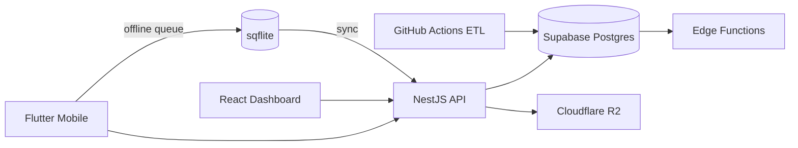

# Architecture

## System overview

Benthyo follows **Option D**: a B2B-anchored citizen-science platform. Three clients share one PostgreSQL database:

1. **Flutter mobile** — offline-first dive logbook, site discovery, species sightings
2. **NestJS API** — business logic, iNaturalist proxy, R2 presigned uploads, operator analytics
3. **React dashboard** — B2B operator portal (customers, sites, analytics)

## Data flow

### Online write path

1. Mobile/dashboard authenticates via Supabase Auth
2. Client sends JWT to NestJS
3. NestJS creates RLS-aware Supabase client with user token
4. Postgres enforces RLS policies
5. Triggers update `user_life_list`, `species_dive_site_stats`
6. Edge function `on-sighting-created` awards badges

### Offline sync path

1. Dive log / sighting saved to sqflite immediately
2. Row added to `sync_queue` table in local DB
3. On connectivity restore, `SyncManager` POSTs to `/api/v1/dive-logs` or `/sightings`
4. Server responds; local queue row deleted

### ETL pipeline

| Job | Schedule | Source | Target |
|-----|----------|--------|--------|
| GBIF | Daily 02:00 UTC | GBIF Occurrence API | `species`, `sightings` |
| OBIS | Daily 03:00 UTC | OBIS API v3 | `species`, `sightings` |
| WoRMS | Weekly Sun 04:00 | marinespecies.org | `species` taxonomy |
| Overpass | Weekly Sun 05:00 | OSM dive nodes | `dive_sites` |

All ETL jobs use idempotent upserts on `(source, external_id)` for sightings and `gbif_taxon_key` / `worms_id` for species.

## B2B data isolation

Operators are multi-tenant via `operator_users` join table. RLS policies:

- `operators`: public read; owner/admin update
- `operator_users`: members see team; owners manage
- `operator_dive_sites`: public read; members insert/delete

NestJS operator endpoints resolve the caller's operator via `operator_users` and use RPCs like `operator_kpis()` for analytics.

## Search

V0 uses PostgreSQL `tsvector` + GIN indexes on `dive_sites` and `species`. Unified search merges ranked site and species results.

## Media

Photos upload directly to Cloudflare R2 via presigned PUT URLs. NestJS never streams file bytes.
